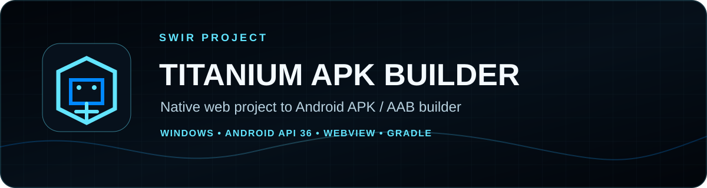
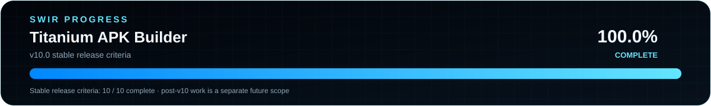

<!-- SWIR-README-STANDARD:v2 -->

<div align="center">



<br>


[](https://github.com/Swir)

</div>

# Titanium APK Builder

Native HTML / ZIP / URL → Android APK / AAB builder for Windows, with a managed build engine and a published standalone Windows release.

## 📍 Project Status

<p align="center">
  
</p>

| Item | Status |
|---|---|
| Current stable line | **10.0.0 — released** |
| Platform | Windows x64 application; Android output targets API 36 by default |
| Latest public release | [v10.0.0](https://github.com/Swir/Titanium-APK-Bulider/releases/tag/v10.0.0) |
| Measured progress scope | **v10.0 stable release criteria: 10 / 10 = 100.0% — COMPLETE** |
| Future work | Tracked separately under `After v10.0` in [ROADMAP.md](ROADMAP.md) |

> The **100.0%** value applies only to the published **v10.0 stable release criteria**. It does not claim that every future Titanium idea or post-v10 enhancement is complete.

## 🚀 Overview

Titanium APK Builder **10.0.0** is the published stable v10 release. Its goal is simple: a user should not have to manually install Android Studio, Python, Node.js, Cordova, JDK or Gradle just to turn a supported web project into an Android application.

Stable release: [`v10.0.0`](https://github.com/Swir/Titanium-APK-Bulider/releases/tag/v10.0.0)

## ✨ Highlights

- Builds local HTML/CSS/JavaScript folders, ZIP web projects and URLs into native Android WebView apps.
- Generates its own Gradle/Android project — no Android Studio template is required.
- Builds APK or AAB in Debug or Release mode and targets Android 16 / API 36 by default.
- Supports JKS signing without persisting signing passwords.
- Provides Simple and Advanced modes, first-run setup, Project Analyzer and safe Build Engine repair.
- Detects or provisions JDK, Gradle, Android SDK components and Google bundletool in user space without administrator rights.
- Retries/resumes managed toolchain downloads and verifies managed archives with SHA-256.
- Supports WebView camera, microphone, geolocation, file upload, downloads, external schemes and HTML5 fullscreen.
- Runs post-build APK/AAB validation before reporting successful output.
- Builds and smoke-tests standalone and Portable Windows packages in CI without relying on Python runtime paths.

## ⚙️ Quick Start

### Recommended — published Windows release

Download the verified **v10.0.0** release assets from GitHub Releases:

- `Titanium-APK-Builder-v10.0.0-Windows-x64.exe`
- `Titanium-APK-Builder-v10.0.0-Windows-x64.exe.sha256`
- `Titanium-APK-Builder-v10.0.0-Portable-Windows-x64.zip`
- `Titanium-APK-Builder-v10.0.0-Portable-Windows-x64.zip.sha256`

[**Open v10.0.0 →**](https://github.com/Swir/Titanium-APK-Bulider/releases/tag/v10.0.0)

### From source

Python 3.11+ is recommended for development:

```bash
python "Titanium V10.py"
```

The v10 application currently uses only the Python standard library at runtime. `pyinstaller>=6.0` is a build-only dependency for producing the standalone Windows executable.

## 🎮 Simple Workflow

1. Choose an HTML folder, ZIP project or URL.
2. Set the app name and package name.
3. Run **Analyze Project**.
4. Build an APK, or switch to Advanced mode for AAB/Release/signing options.

## 🌐 WebView Compatibility Engine

Generated apps include Android runtime permission bridges for camera, microphone and location. HTML `<input type="file">` opens the native picker; HTTP/HTTPS downloads use Android `DownloadManager`; non-web schemes such as `tel:`, `mailto:`, `sms:`, `geo:`, `market:` and `intent:` are routed through Android handlers.

HTML5 custom-view/fullscreen content is supported, back navigation exits fullscreen before traversing WebView history, and the generated Activity explicitly destroys its WebView during teardown.

## 🔎 Project Analyzer

Before Gradle starts, Titanium can report or block problems such as missing `index.html`, missing local assets, unsafe ZIP paths, plain-HTTP references, problematic `file://` references, PWA/service-worker usage and unusually large ZIP projects.

Blocking findings stop the build before Android compilation begins.

## 🔐 Release Signing and Post-Build Validation

The CI release gate creates a fresh temporary signing keystore, builds both a signed Release APK and AAB, verifies the APK with Android Build Tools `apksigner`, checks AAB signing integrity and validates the bundle with SHA-256-pinned Google `bundletool 1.18.3`.

Titanium performs validation itself after a normal build. APK output is ZIP-integrity checked and passed through `apksigner`. AAB output is ZIP-integrity checked, structurally validated with `bundletool`, and checked with JDK `jarsigner` plus real signature metadata under `META-INF`.

## 🧰 Zero-Manual-Setup Model

The standalone EXE does not require Python on the target PC. The Portable package contains:

- Titanium APK Builder EXE;
- Eclipse Temurin JDK 21;
- Gradle 9.6.0;
- Google bundletool 1.18.3;
- documentation, notices and the bundletool Apache 2.0 license.

The release workflow verifies JDK, Gradle and bundletool downloads, confirms `java.exe`, `jarsigner.exe`, `gradle.bat` and bundletool execution, then smoke-launches Titanium from inside the Portable directory with Python removed from `PATH`, `PYTHONHOME` and `PYTHONPATH`.

### Android SDK Licensing

Android SDK components are **not** redistributed in the Portable ZIP. Titanium displays the Android SDK license notice and provisions the command-line tools, Platform Tools, API 36 platform and Build Tools 36.0.0 into a private per-user directory only after the user accepts the SDK terms.

The isolated managed-engine CI starts without detectable system Java, Android SDK or Gradle, provisions the complete Titanium-managed toolchain into a fresh user-data directory, deliberately damages managed components and proves **Repair Build Engine** restores them. No Android Studio or administrator rights are required for normal use.

## 🛡️ Release Workflow Safety

Release packaging and release publication are separate jobs. Pull requests build the exact release package with read-only repository permissions. The write-enabled publish job is skipped for pull requests and is limited to explicit release/tag events or the dedicated `release/v10.0.0` publication branch.

Stable downloadable assets use versioned names and include SHA-256 checksum files.

## 🔒 Security

Titanium v10 does **not** globally terminate `java.exe`, does not save signing passwords in its JSON configuration, rejects ZIP path traversal and passes signing secrets to Gradle only through the process environment. Managed downloads are checksum-verified and Repair Build Engine only modifies Titanium-managed files.

See [`SECURITY.md`](SECURITY.md), [`THIRD_PARTY_NOTICES.md`](THIRD_PARTY_NOTICES.md), [`TROUBLESHOOTING.md`](TROUBLESHOOTING.md) and [`MIGRATION_V9_TO_V10.md`](MIGRATION_V9_TO_V10.md).

## 🗺️ Roadmap / Progress

<p align="center">
  
</p>

| Measured scope | Completed | Total | Progress | Status |
|---|---:|---:|---:|---|
| v10.0 stable release criteria | **10** | **10** | **100.0%** | **COMPLETE** |

The authoritative roadmap remains [ROADMAP.md](ROADMAP.md). Its `After v10.0` section contains future/non-blocking work and is intentionally separate from the completed v10.0 stable release criteria.

Progress SVGs are generated from that named criteria section and can be checked with:

```bash
python tools/generate_progress.py --check
```

## 📦 Releases

The current stable public release is **v10.0.0**. It includes the versioned Windows EXE, Portable Windows ZIP and matching SHA-256 checksum files.

[**GitHub Releases →**](https://github.com/Swir/Titanium-APK-Bulider/releases)

## 🧪 Verified v10.0 Release Scope

The exact stable application line passed the Windows EXE launch gate, real API 36 debug build, signed Release APK/AAB validation, exact Portable package gate and isolated managed Build Engine Prepare/Repair gate before publication.

## 🧱 Legacy v9

`Titanium V9.py` is retained so the published `v9.0.0` release remains reproducible.

## ⚠️ Limitations / Notes

- Android SDK components require explicit license acceptance and are provisioned rather than redistributed.
- Optional post-v10 ideas such as deeper PWA conversion, additional desktop platforms, plug-in APIs and direct Play Console workflows are future work, not part of the v10.0 completion claim.
- A valid signing keystore and correct credentials remain the user's responsibility for their own release signing.
- Build success for arbitrary third-party web projects can depend on project compatibility discovered by the analyzer and Android/WebView constraints.

## 🔎 Search Keywords

`titanium apk builder` • `html to apk windows` • `zip to android apk` • `url to apk builder` • `android webview builder` • `apk aab builder windows` • `android api 36 builder` • `managed android build engine` • `gradle apk builder` • `android app bundle builder` • `jks signing gui` • `portable android build tool` • `web app to android` • `python windows apk builder` • `android webview packaging`

<div align="center">

### `ANALYZE • BUILD • SIGN • VERIFY`

⭐ **If Titanium is useful, consider leaving a star.**

[**← SWIR profile**](https://github.com/Swir) · [**All projects →**](https://github.com/Swir?tab=repositories)

</div>
